# dados-enem-2019

Trabalhando e analisando os Dados da Educação do Brasil no Enem 2019.

## O Projeto

Alguns exemplos de gráficos das análises realizadas:

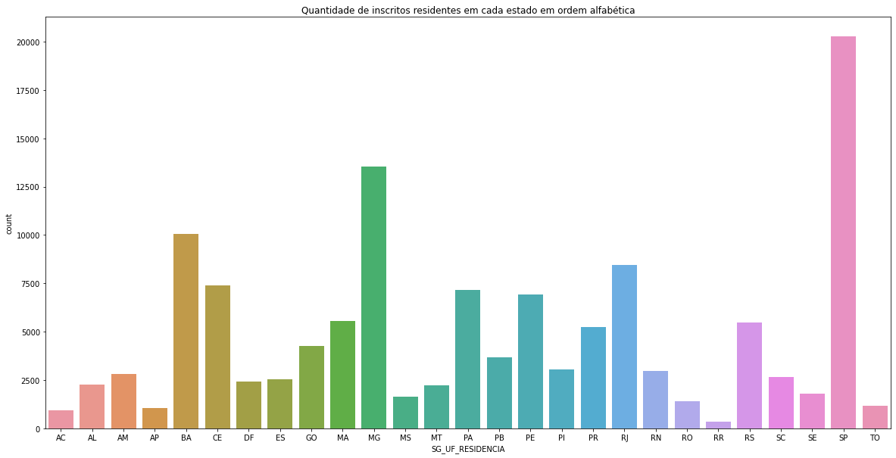 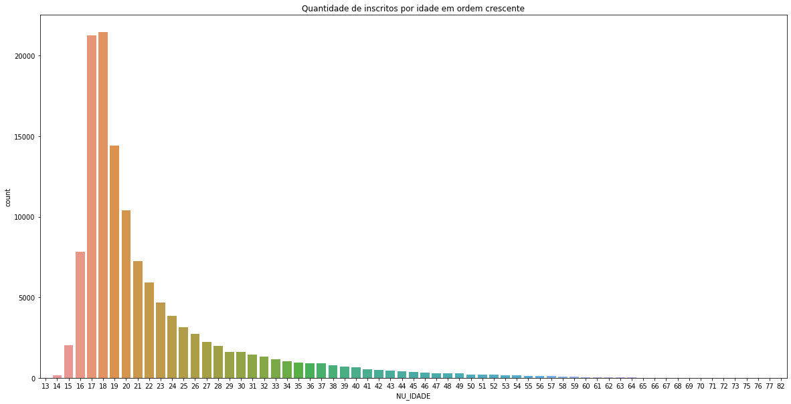 
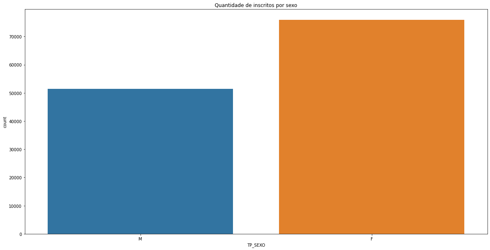 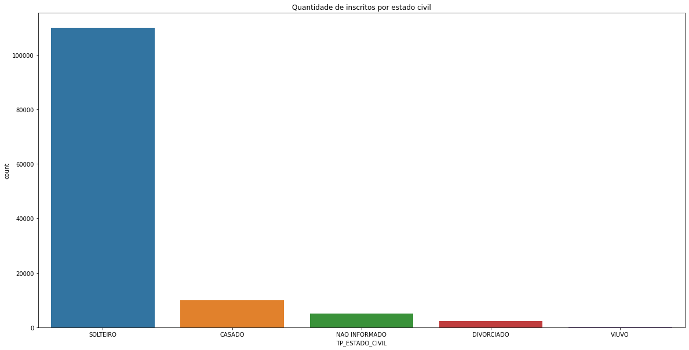
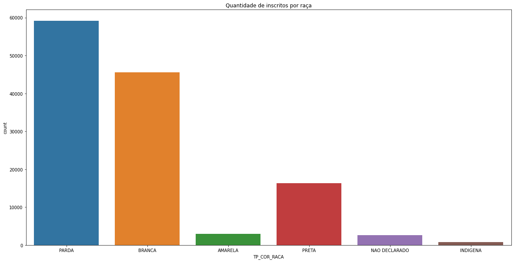 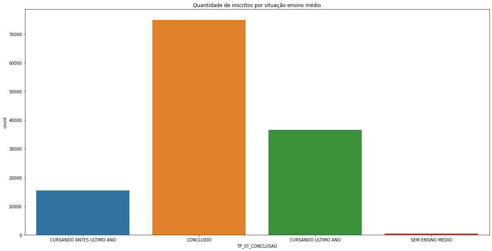
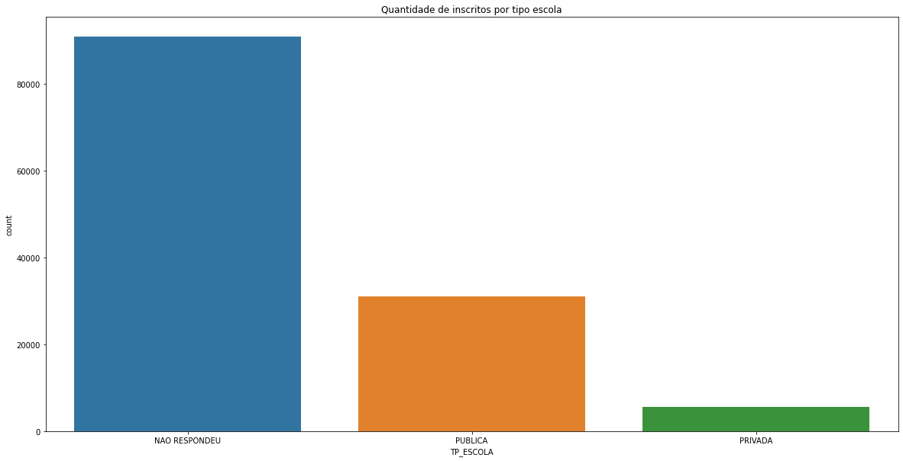 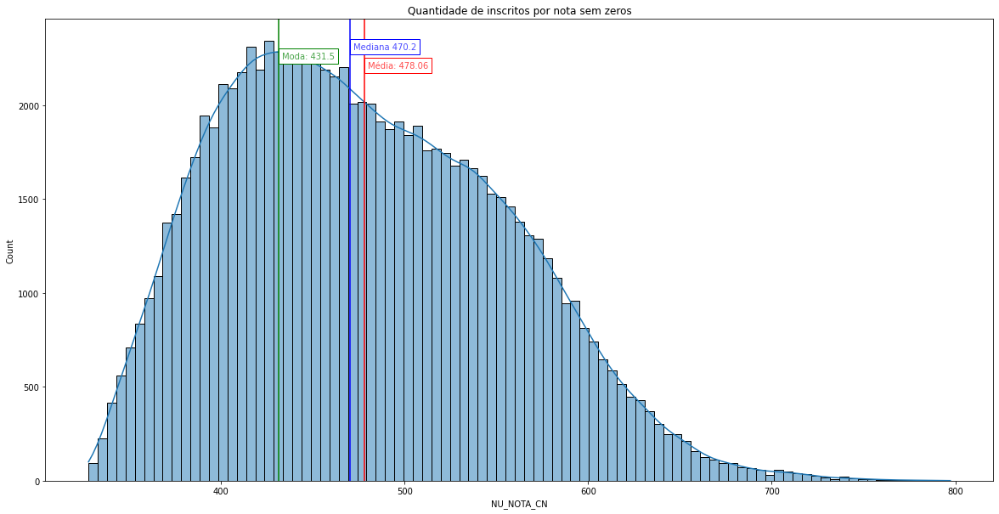
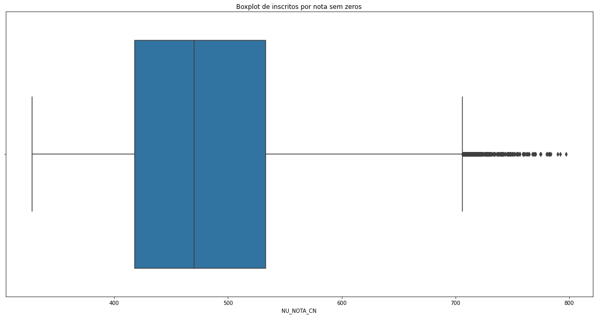 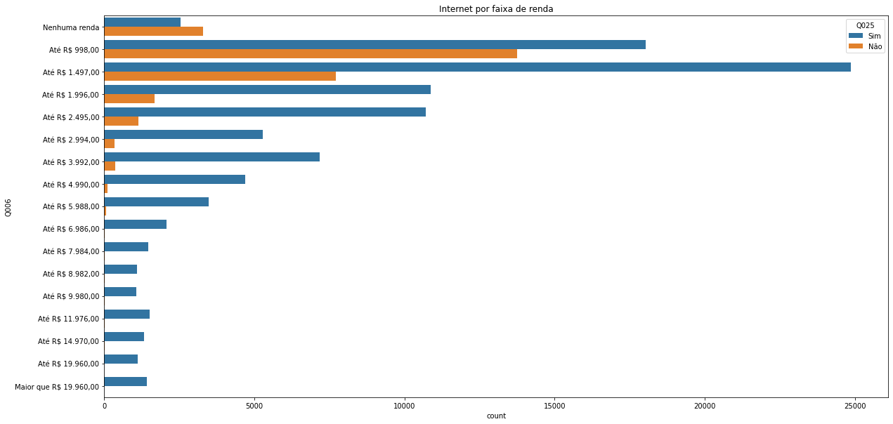
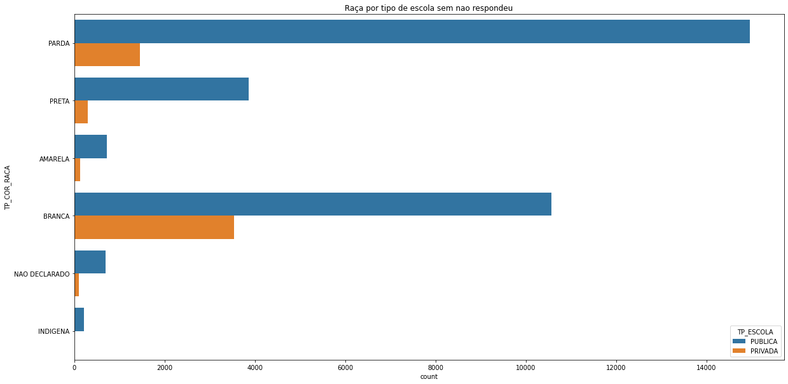 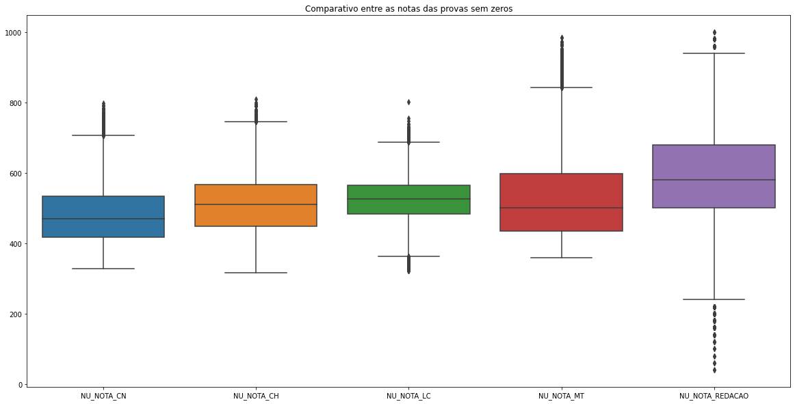
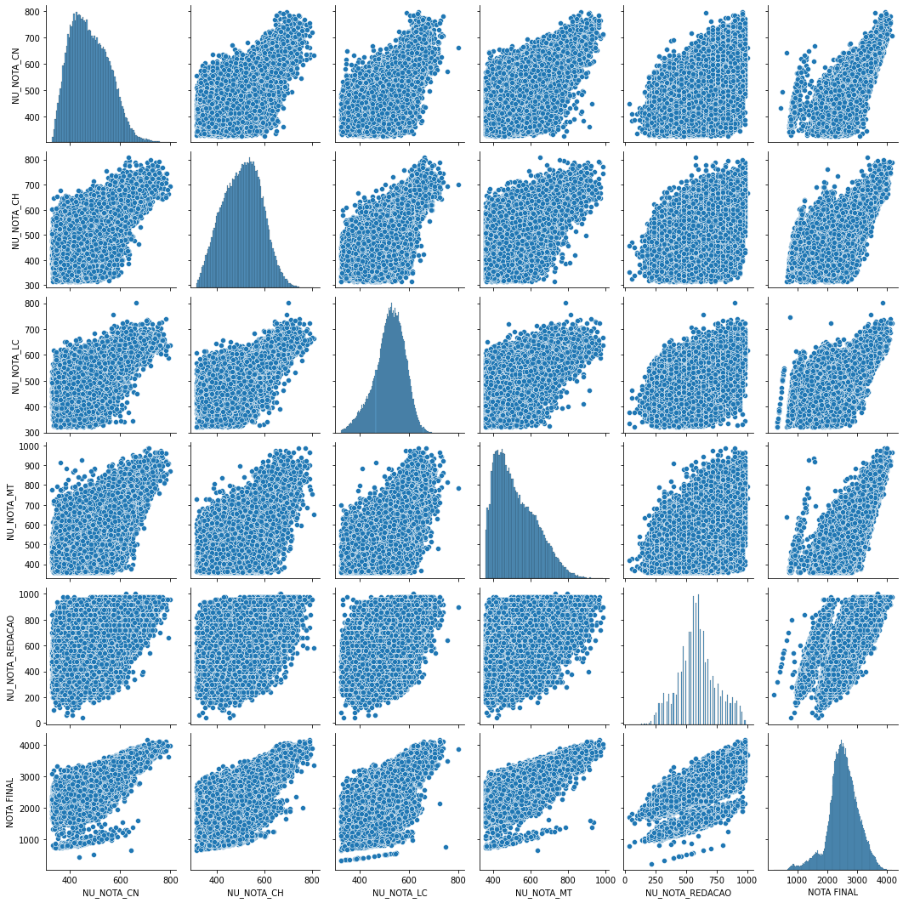 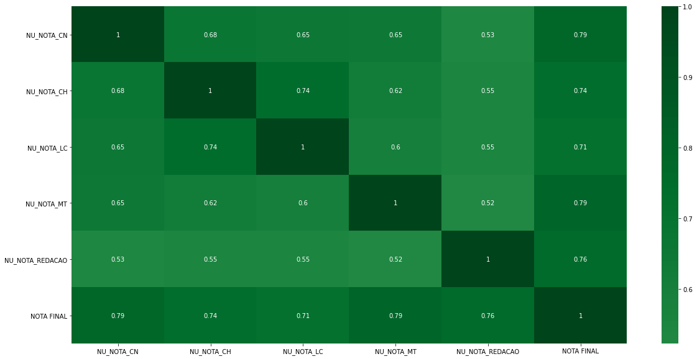
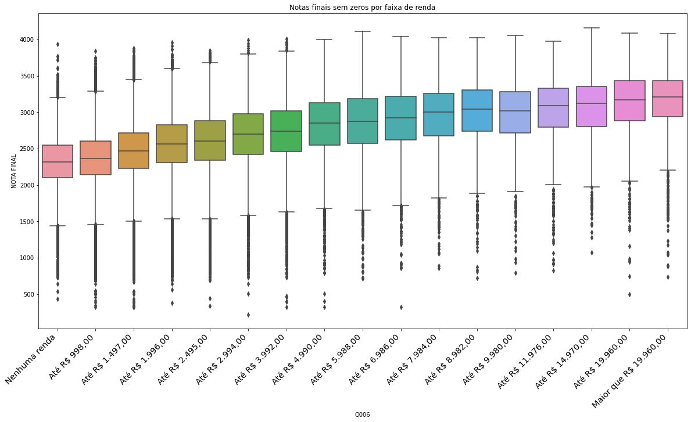 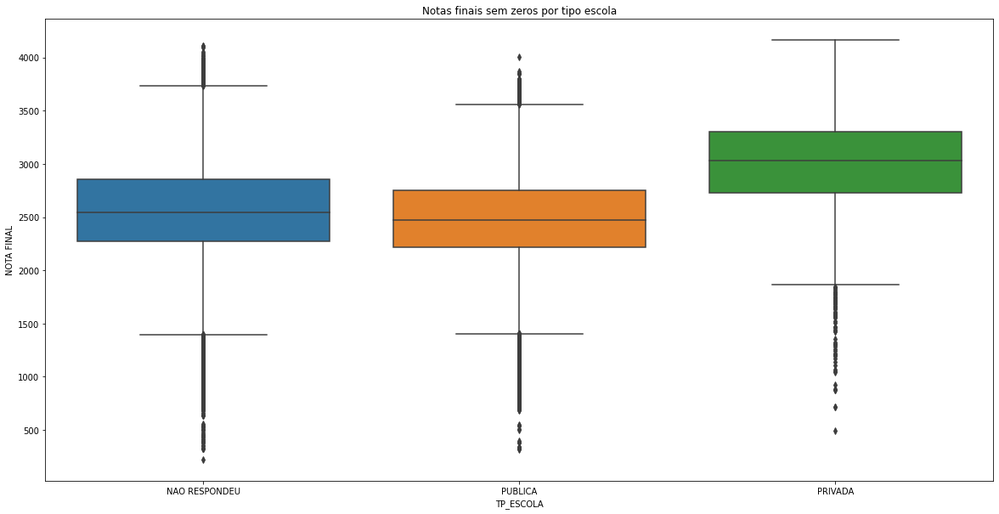

## Sobre

### Base de dados

O sample de dataset utilizado neste projeto pode ser encontrado no arquivo [./MICRODADOS_ENEM_2019_SAMPLE_43278.csv](./MICRODADOS_ENEM_2019_SAMPLE_43278.csv)

O dataset completo pode ser encontrado no site do [INEP](http://inep.gov.br/web/guest/microdados).

### Observações

- Foram utilizados muitos gráficos e correlações simples, que por si só, apresentam informações básicas. Mas que se analizados como um conjunto, conseguem expor muitas outras informações interessantes.

- Existem alguns comentários de conclusões ao longo do código que resumem um pouco o que estava sendo analisado em cada caso.

- A intenção deste notebook é para analisar o dataset da maneira rápida, sem muitas firulas nos gráficos (até porque esta parte é bem trabalhosa), sendo o mais simples possível e claro, tentando manter organizado.

- Esta análise foi feita com uma amostra dos dados do Enem 2019, portanto as conclusões podem, sem querer, ter algum tipo de viés.

### Realização

Realizado entre os dias 19/10 e 25/10 durante a Imersão Dados da Alura.

Repo do evento: [Alura - Imersão Dados](https://github.com/alura-cursos/imersao-dados-2-2020).

